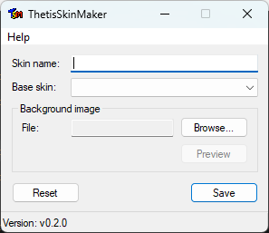

#+title: Thetis Skin Maker

A program to create skins for OpenHPSDR Thetis.

** Requirements
- Meson
- MinGW toolchain (MSVC is not supported)

Meson and the MinGW toolchain can be installed using MSYS2 on Windows.

** Build instructions

*** Setting up build folder
#+begin_src sh
meson setup build
#+end_src

Cross-compiling on Linux can use the following command:
#+begin_src sh
meson setup --cross-file=x86_64-w64-mingw32.txt build
#+end_src

*** Compilation
#+begin_src sh
ninja -C build
#+end_src
